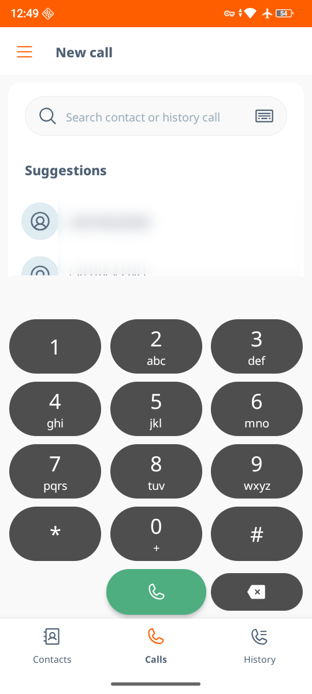
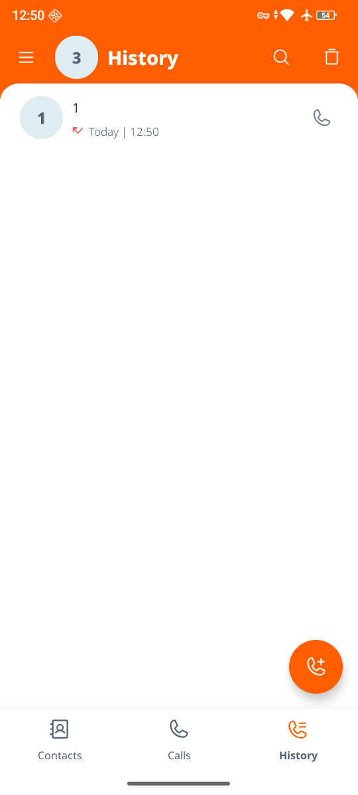

# Linphone Android — call-focused fork

This is a personal fork of [BelledonneCommunications/linphone-android](https://github.com/BelledonneCommunications/linphone-android), tuned for using Linphone mainly as a phone dialer. Upstream is merged in weekly; everything below is what differs from upstream.

| Calls tab (default launch screen) | History tab |
|:---:|:---:|
|  |  |

### Changes from upstream

**Navigation**
- The bottom bar is **Contacts · Calls · History · Meetings**. The Conversations tab is gone (chat still opens from notifications and contacts).
- **Calls** is the *New call* screen (search + dialpad) and the app always opens on it; it no longer reopens the last visited tab.
- **History** is upstream's call history list, with the missed calls badge. Its "new call" button switches to the Calls tab.

**Dialpad**
- On the Calls tab the dialpad can't be dismissed: no swipe-down, no handle, back doesn't close it. It only steps aside while the keyboard is open or while picking group call participants.
- Contact search waits until you stop dialing for **0.5 s** instead of searching on every digit (Calls tab, and the in-call new call / transfer screens).
- The whole dialpad grid is touchable: each button's touch area includes the gaps around it, while the buttons look the same. Also applies to the in-call DTMF pad.

**Incoming calls**
- **Volume up or down answers** the call; **power declines** it, on the incoming call screen. Android swallows the volume key-press while a call rings, so the call is answered on key release. Apps can't see the power key, so declining relies on the screen turning off while this screen (which keeps the display on) is shown.
- The incoming call screen now also opens when Linphone is already on screen; upstream only shows a heads-up banner in that case.

**Merged upstream pull requests**
- [#2497](https://github.com/BelledonneCommunications/linphone-android/pull/2497) — dialing with hardware numpad keys (by Tobias Diendorfer).

**Build**
- `versionCode` / `versionName` stay at upstream's values in git; release builds set them at build time (`<upstream version>-fork.<versionCode>`).

---

Linphone is an open source softphone for voice and video over IP calling and instant messaging.

It is fully SIP-based, for all calling, presence and IM features.

General description is available from [linphone web site](https://linphone.org).

### License

Copyright © Belledonne Communications

Linphone is dual licensed, and is available either :

 - under a [GNU/GPLv3 license](https://www.gnu.org/licenses/gpl-3.0.en.html), for free (open source). Please make sure that you understand and agree with the terms  of this license before using it (see LICENSE file for details).

 - under a proprietary license, for a fee, to be used in closed source applications. Contact [Belledonne Communications](https://linphone.org/contact) for any question about costs and services.

### Documentation

- Supported features and RFCs : https://www.linphone.org/linphone-softphone/#linphone-fonctionnalites

- Linphone public wiki : https://wiki.linphone.org/xwiki/wiki/public/view/Linphone/

- Tutorials : https://gitlab.linphone.org/BC/public/tutorials/-/tree/master/android/kotlin

# Building the app

If you have Android Studio, simply open the project, wait for the gradle synchronization and then build/install the app.  
It will download the linphone library from our Maven repository as an AAR file so you don't have to build anything yourself.

If you don't have Android Studio, you can build and install the app using gradle:
```
./gradlew assembleDebug
```
will compile the APK file (assembleRelease to instead if you want to build a release package), and then
```
./gradlew installDebug
```
to install the generated APK in the previous step (use installRelease instead if you built a release package).

APK files are stored within ```./app/build/outputs/apk/debug/``` and ```./app/build/outputs/apk/release/``` directories.

When building a release AppBundle, use releaseAppBundle target instead of release.   
Also make sure you have a NDK installed and that you have an environment variable named ```ANDROID_NDK_HOME``` that contains the path to the NDK.  
This is to be able to include native libraries symbols into app bundle for the Play Store.

## Building a local SDK

1. Clone the linphone-sdk repository from out gitlab:
```
git clone https://gitlab.linphone.org/BC/public/linphone-sdk.git --recursive
```

2. Follow the instructions in the linphone-sdk/README file to build the SDK.

3. Create or edit the gradle.properties file in $GRADLE_USER_HOME (usually ~/.gradle/) and add the absolute path to your linphone-sdk build directory, for example:
```
LinphoneSdkBuildDir=/home/<username>/linphone-sdk/build/
```

4. Rebuild the app in Android Studio.

## Native debugging

1. Install LLDB from SDK Tools in Android-studio.

2. In Android-studio go to Run->Edit Configurations->Debugger.

3. Select 'Dual' or 'Native' and add the path to linphone-sdk debug libraries (build/libs-debug/ for example).

4. Open native file and put your breakpoint on it.

5. Make sure you are using the debug AAR in the app/build.gradle script and not the release one (to have faster builds by default the release AAR is used even for debug APK flavor).

6. Debug app.

## Known issues

- If you have the following build issue `AAPT: error: resource drawable/linphone_logo_tinted (aka org.linphone:drawable/linphone_logo_tinted) not found`, delete the `app/src/main/res/xml/contacts.xml` file (you can do it simply with `git clean -f` command) and start the build again.

- If you encounter the `couldn't find "libc++_shared.so"` crash when the app starts, simply clean the project in Android Studio (under Build menu) and build again.
Also check you have built the SDK for the right CPU architecture using the `-DLINPHONESDK_ANDROID_ARCHS=armv7,arm64,x86,x86_64` cmake parameter.

- Push notification might not work when app has been started by Android Studio consecutively to an install. Remove the app from the recent activity view and start it again using the launcher icon to resolve this.

## Troubleshooting

### Native crash

First of all, to be able to get a symbolized stack trace, you need the debug version of our libraries.

If you haven't built the SDK locally (see [building a local SDK](#BuildingalocalSDK)), here's how to get them:

1. Go to our [maven repository](https://download.linphone.org/maven_repository/org/linphone/linphone-sdk-android/) and find the directory that matches the version of our SDK that crashed.

2. Download the linphone-sdk-android-<version>-libs-debug.zip archive.

3. Extract the symbolized libraries somewhere on your computer, it will create a ```libs-debug``` directory.

Now you need the ```ndk-stack``` tool and possibly ```adb logcat```.
If your computer isn't used for Android development, you can download those tools from [Google website](https://developer.android.com/studio#downloads), in the ```Command line tools only``` section.

Once you have the debug libraries and the proper tools installed, you can use the ```ndk-stack``` tool to symbolize your stacktrace. Note that you also need to know the architecture (armv7, arm64, x86, etc...) of the libraries that were used.

If you know the CPU architecture of your device (most probably arm64 if it's a recent device) you can use the following to get the stacktrace from a device plugged to a computer:
```
adb logcat -d | ndk-stack -sym ./libs-debug/arm64-v8a/
```
If you don't know the CPU architecture, use the following instead:
```
adb logcat -d | ndk-stack -sym ./libs-debug/`adb shell getprop ro.product.cpu.abi | tr -d '\r'` 
```
Warning: This command won't print anything until you reproduce the crash!

Starting [NDK r29](https://github.com/android/ndk/wiki/Changelog-r29) you will be able to directly use the ```libs-debug.zip``` file in ```ndk-stack -sym``` argument.

## Create an APK with a different package name

Simply edit the ```app/build.gradle.kts``` file and change the value of the ```packageName``` variable.
The next build will automatically use this value everywhere thanks to ```manifestPlaceholders``` feature of gradle and Android.

We no longer build the debug flavor with a different package name, but if you still want that behavior you only have to change the value of ```useDifferentPackageNameForDebugBuild``` to ```true```. When enabled, app built and installed by Android studio will have ```org.linphone.debug``` package name instead of ```org.linphone```.

If you encounter
```
Execution failed for task ':app:processDebugGoogleServices'.
> No matching client found for package name 'your package name'
```
error when building, make sure you have replaced the ```app/google-services.json``` file by yours (containing your package name).
If you don't have such file because you don't rely on Firebase Cloud Messaging features nor Crashlytics, delete the file instead.

## Firebase push notifications

Now that Google Cloud Messaging has been deprecated and will be completely removed on April 11th 2019, the only official way of using push notifications is through Firebase.

However to make Firebase push notifications work, the project needs to have a ```app/google-services.json``` file that contains the configuration.  
We have archived our own, so you can build your linphone-android application and still receive push notifications from our free SIP service (sip.linphone.org).
If you delete it, you won't receive any push notification.

If you have your own push server, replace this file by yours.
